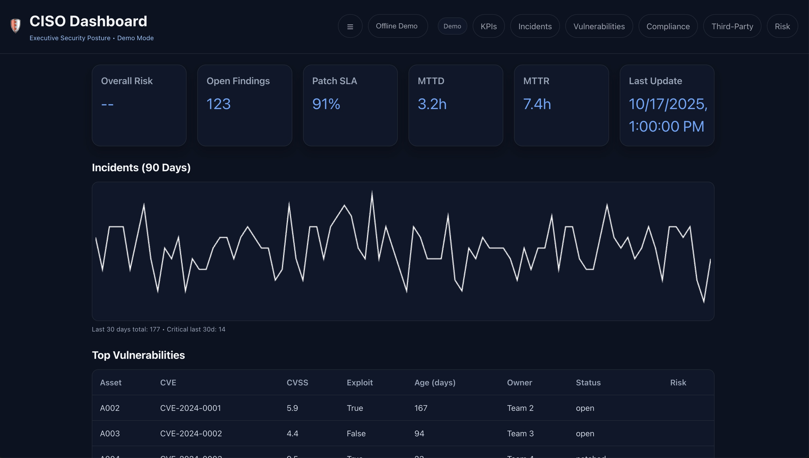

# CISO Dashboard

A practical, open-source starter for a **CISO-friendly security dashboard** — designed to showcase KPIs, controls coverage, incidents, and risk posture at a glance.

> Built by **@SiteQ8** • Secure-by-default • Docs-first • Easy to extend

---

## ✨ Highlights

- **Executive KPIs**: Risk score, SLA compliance, open findings, MTTR, patch cadence
- **Controls Coverage**: CIS, NIST CSF 2.0 mapping examples
- **Incident Lens**: Alerts → triage → response (dummy data pipeline)
- **Vendor & Asset View**: Third-party risks, asset exposure samples
- **Cloud & IAM Posture**: Example checks & placeholders
- **Simple Deploy**: Docker Compose or `uvicorn` + static web site

---

## 📸 Screenshots




---

## 🧱 Repo Layout

```
CISO-Dashboard/
├─ README.md
├─ LICENSE
├─ SECURITY.md
├─ CONTRIBUTING.md
├─ CODE_OF_CONDUCT.md
├─ docker-compose.yml
├─ .github/workflows/ci.yml
├─ data/
│  ├─ sample_incidents.csv
│  └─ sample_assets.csv
├─ backend/
│  ├─ app.py
│  ├─ requirements.txt
│  └─ sample_metrics.py
├─ website/        # Static site example to upload to GitHub Pages
│  ├─ index.html
│  ├─ style.css
│  └─ app.js
├─ docs/
│  ├─ ARCHITECTURE.md
│  ├─ API.md
│  ├─ DEPLOYMENT.md
│  ├─ CONFIGURATION.md
│  ├─ ROADMAP.md
│  └─ METRICS.md
└─ assets/
   └─ screenshots/
      ├─ overview.png
      ├─ controls.png
      └─ incidents.png
```

---

## 🚀 Quick Start

### Option A — Docker (recommended)
```bash
docker compose up --build
```
- Backend FastAPI at: http://localhost:8000 (endpoints: `/health`, `/metrics`, `/kpis`)
- Static website at: http://localhost:8080

### Option B — Local (Python)
```bash
cd backend
python -m venv .venv && source .venv/bin/activate  # Windows: .venv\Scripts\activate
pip install -r requirements.txt
uvicorn app:app --reload --port 8000
```
Open `website/index.html` in your browser (or serve via `python -m http.server 8080` from `website/`).

---

## 🧪 Try the API

```bash
curl http://localhost:8000/health
curl http://localhost:8000/metrics
curl http://localhost:8000/kpis
```

---

## 🧭 What to Customize First

1. **KPIs in `backend/sample_metrics.py`** — align with your org’s metrics.
2. **Controls mapping in `docs/METRICS.md`** — add CIS/NIST control IDs you track.
3. **Static site text in `website/index.html`** — your logo, tone, and sections.
4. **Data samples in `data/`** — replace with real (non-sensitive) exports.
5. **CI in `.github/workflows/ci.yml`** — add tests, linting, and builds.

---

## 🌐 Publish the Website (GitHub Pages)

- Push the repo to GitHub under `SiteQ8/CISO-Dashboard`
- In **Settings → Pages**, pick `main` branch and `/website` folder
- Visit your site at: `https://siteq8.github.io/CISO-Dashboard/`

> Tip: Keep executive content in `website/` and technical API in `backend/`

---

## 🛡️ Security

- No prod secrets in the repo
- Sample data only (no PII)
- See **SECURITY.md** to report issues

---

## 🤝 Contributing

We welcome PRs and issues. See **CONTRIBUTING.md** and **CODE_OF_CONDUCT.md**.

---

## 📅 Roadmap (Short)

- [ ] Add real charts to static site pulling from backend
- [ ] Add auth + role-based views (CISO vs SOC lead)
- [ ] Add connectors (SIEM, EDR, CSPM) via scheduled jobs
- [ ] Export slides/PDF for board reporting
- [ ] Multi-tenant mode for groups

---

## 📝 License

MIT — see **LICENSE**.
